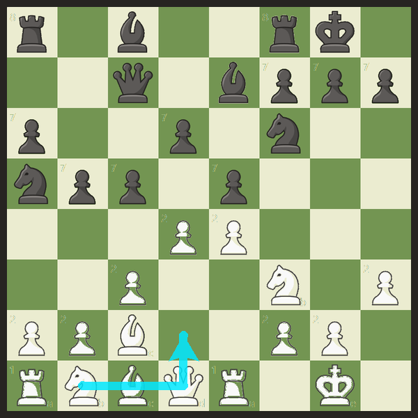

# ChessWatch

Watches the chess.com board on your screen and saves every game to your own disk
as PGN and JSON. Desktop app, not a browser extension. It never touches your
account and nothing leaves the machine.

## Run it

    run.bat

Or `python chesswatch.py`. It starts watching by itself and finds the board on
its own. There is nothing to set up.

Recording starts from the opening position, so start a new game rather than
joining one halfway through.

## What you get

Every game lands in `games\` as a matched pair:

    games\2026-08-30_190621.pgn     open in any chess program
    games\2026-08-30_190621.json    move by move, tagged me vs opponent

The JSON is the one for studying:

```json
{ "ply": 6, "number": 4, "side": "white", "san": "O-O", "by": "me" }
```

The file also carries `my_color`, `result`, `termination` and `outcome`, so you
can filter later for the games you lost as black.

Files are written as you play, not at the end, so closing the browser mid-game
loses nothing. Starting a new game closes out the old one automatically.

## Asking what to play

Open **Setup** and tick **Coach**, and Stockfish is started, once, and asked
about whatever position is on screen. The line above the moves reads:

```
your move  Nf3
knight: g1 to f3   +0.4
```

Whose move it is and what to play is the large line, and the naming of the
squares is the small print under it.

Piece and squares in words rather than only the notation, what a capture takes,
when a move gives check, and a forced mate counted in moves. `coach.py` holds
that, and it runs on its own thread with a 300 ms budget so the reader never
waits on it. Only the newest question is answered, and an answer that arrives
after the position has changed is dropped rather than shown against the wrong
board.

You supply the engine. `coach.py` looks at `$STOCKFISH_PATH`, then
`chesswatch\engine\stockfish`, then the sibling `holochess\engine\stockfish`,
then your `PATH`. Without one the switch says so and turns itself back off.

## The arrow on the board

Tick **Arrow** as well and the suggestion is drawn on the board itself, on top
of whatever program is showing it. The window is click-through, so it sits over
the board without getting between you and it.

The arrow is a function of the position on screen, not of the last thing the
engine said. Play a move and it comes down at once rather than sitting on the
new position until a reply arrives, drag the window and it follows, lose the
board and it goes. **clear**, which appears beside the move for as long as
there is an arrow to clear, takes it away now and keeps the reply the engine is
already working on from putting it straight back, which lasts until your next
move and then stops on its own.



The awkward part is that the recorder is reading the same pixels the arrow is
painting on, and it must not be able to corrupt a game.

`read_occupancy` converts the board to grey and counts only pixels brighter
than 244 or darker than 70. Everything in between is already thrown away, which
is how highlights, coordinate labels and the check marker are ignored. So the
arrow is drawn in a colour that lands in that gap. Cyan greys to 165, and even
blended at 85 per cent over pure white or pure black it stays inside the band.
The reader cannot see it.

The one thing arrow coverage can still do is hide a piece, which would make an
occupied square read empty. That position matches no legal move, so the frame
is ignored and the recorder waits, exactly as it does for a piece in mid
animation. It cannot write down a move that did not happen.

`overlaytest.py` measures this rather than asserting it. Sixteen arrows across
the crowded ranks, arrows landing on pieces, at 664px and again at 240px: every
one of them is confirmed to be on the board, not one of them changed a single
square, and every pixel any of them touched is confirmed to have landed between
the two cutoffs. Then it plays a whole game with an arrow up for every frame and
checks the moves came out right.

The check that the arrow is really there is the important one. Without it an
overlay that drew nothing at all would pass every other check in the file.

By default the arrow is modelled in PIL: the same path from `overlay.py`, the
same colour, the same width, composited the way a layered window at `ALPHA`
composites. That settles the colour and the geometry and costs no screen space.
`--on-screen` puts the real overlay window over a real board and captures it
through mss, which is the only run that touches the transparency key, the
stacking order and click-through.

## How it works

It reads the **board**, not the move list.

```
   chess.com on screen
          |
          |  find the board by its two square colours,
          |  then prove it is really a checkerboard
          v
   +--------------+     each square -> white piece / black piece / empty
   | 64 squares   | --> empty squares score 0.000, pieces score 0.15-0.43,
   +--------------+     so the margin is huge and themes do not matter
          |
          v
   +--------------+     which legal move turns the previous position
   | python-chess | --> into the one now on screen? That is the move.
   +--------------+
          |
          v
   games\*.pgn + *.json
```

Three things fall out of doing it this way:

**Piece names come from the rules, not from pixels.** The reader only sees that
a dark piece left d8 and a dark piece arrived on h4. Only one legal move does
that, so the move is `Qh4`. Nothing has to recognise a queen. This is why
figurine notation in the move list, board themes and piece sets are all
irrelevant.

**It waits out the animation.** chess.com slides a piece to its destination over
a couple of hundred milliseconds, and part way through, the piece is sitting on
a square in between. For `e2-e4` the board reads as a clean, still `pawn on e3`
for about a tenth of a second, and `e3` is itself a legal move. A rook sliding
h3 to a3 passes over g3, f3, e3 and d3. Castling reads as `Kf1` on the way.

So the screen genuinely shows a legal move that never happened, and counting
agreeing reads cannot help, because every read inside that window agrees with
the others. Two things separate a real move from a piece in flight:

- Only a move whose destination lies **between** its origin and a longer legal
  move by the same piece can be faked this way. Those are marked as suspect and
  have to hold still for over a second before they are believed.
- Everything else, which is most of a game, is believed after a quarter of a
  second.

A recorder can afford the delay. Being wrong is what it cannot afford.

**A frame it cannot read is a frame it ignores.** The position on screen has to
match a legal successor exactly, all 64 squares. A piece mid-animation, a piece
being dragged, or a dialog over the board matches nothing, so it waits instead
of guessing. If it misses a frame entirely and two moves go by, it searches two
moves deep and catches up.

**Promotions are read, not assumed.** A promoted queen and a promoted knight
leave an identical white/black picture, so the piece reader is asked what
actually appeared on the promotion square. All four promotions come out right;
before this an underpromotion was silently written down as a queen.

**The result comes off the board.** Checkmate, stalemate, insufficient material
and repetition are read from the position itself. Resignations and timeouts
leave no trace on the board, so those games are saved with `Result "*"`.

Your colour comes from which way the board is facing, since chess.com always
puts you at the bottom.

## The piece checker

Everything above only ever asks "white piece, black piece, or empty?". That is
fast, but it cannot tell you what is on a square it has lost track of. So there
is a second, slower reader that identifies the actual piece on all 64 squares,
and it runs every few seconds, whenever the fast reader has been stuck for a
while, and whenever you press **Setup > Board > Recheck**.

It works the same way as everything else here: a square is reduced to a mask of
its very bright and very dark pixels, which is the piece and nothing else, since
board colours, highlights, the check marker and the coordinate labels all fall
between the two cutoffs. That mask is matched against the twelve piece shapes.
Colour is settled first, so each match is a 1-of-6 choice.

The templates ship in `pieces.png`, and are relearned from your own screen every
time a game starts from the opening position, where what sits on every square is
already known. **Setup** says which set is in use.

Relearning needs all twelve piece types on the board at once, which in practice
means a game you watched from the first move. A game joined part way through on
a piece set the bundled sheet has never seen has no way to get there, and reads
almost nothing. **Setup > Board > Pieces** is the way out: it shows the board
cut into its 64 squares with what the reader currently believes about each one,
and you click a square and say what is on it. Twelve labels is the whole job, and it
starts from the reader's own answer, so on a set it already half reads you only
correct what is wrong. What it writes is a template sheet, kept in `taught.png`
and loaded again next time you start.

It keeps one square of each colour per piece where it can, and clicking a second
square of the other colour is what buys the better read. Board colour is not
thrown away by the mask, so a rook cut from a light square is being compared
against a dark square rook on the square colour as much as on the shape: teach
the pieces of 6.png from single squares and its h8 rook scores 0.518 as a pawn
against 0.413 as a rook and is read as a pawn. With both colours the same rook
scores 0.749 and every one of the 64 squares that is read at all is read right.

It runs on its own too, against a screenshot rather than the screen:

    python enroll.py board.png

The checker does four things:

- **Confirms** the game so far really is what is on screen.
- **Catches up** when moves were missed, up to three of them.
- **Rewinds** a takeback.
- **Joins a game already in progress**, which the fast reader cannot do, because
  it has no way to know what an unfamiliar piece is.

### If it joins part way through

Nothing in a picture of a board says how many moves were played before you
started watching. So a game picked up part way through is counted from where
watching began, and both the app and the saved files say so: the move list is
prefixed `+1, +2, ...`, the PGN carries the position it started from plus a note
in the Annotator header, and the JSON has `joined_in_progress` and a `numbering`
field spelling it out.

If you want move numbers that line up with chess.com, leave ChessWatch running
before you start the game. Then it sees the opening position, numbers from 1,
and relearns the piece shapes from your own screen at the same time.

**A finished game is read-only.** chess.com opens Game Review the moment a game
ends, and clicking back through it puts an earlier position on screen. That used
to read as a takeback and overwrite the finished file with a fragment. Games
that end off the board, by resignation or timeout, cannot be detected as
finished at all, so on top of that a saved game is never allowed to get shorter
on disk. A real takeback diverges rather than truncating, and is still recorded.

It will not guess. Several cases where it deliberately stops:

*Three missed moves that could have happened in either order.* 1.e4 e5 2.Nf3 and
1.Nf3 e5 2.e4 leave exactly the same picture. Two missed moves can never
transpose, because the colours alternate, so those are always safe to fill in.
Three can, and rather than write down a plausible order that did not happen, it
says it lost the thread and starts a fresh record from the position on screen.

*Two stories that leave the same picture.* A pawn's double push followed by an
en passant capture leaves exactly the same board as a single push followed by an
ordinary one. A capture and a recapture on the same square hide that square
completely. If a frame is missed at that moment, both readings fit, and neither
can ever be told apart afterwards, so it records nothing rather than a coin
flip.

*Joining a game before it knows which way the board faces.* A board rotated
half a turn is itself a legal game, so a knight or queen move explains the
screen equally well both ways up. A pawn move does not, because pawns only move
one way, so the first pawn move settles it, usually within seconds. If you would
rather not wait, set **Setup > Side** to white or black and any move will do.

## Things it copes with

**A small browser window.** The move list is never read, so it does not matter
whether that panel is on screen. Only the board has to be visible. Reading is
correct down to a board of about 130 pixels, which is far smaller than anything
you would actually play on. A normal small window is around 660 pixels.

**Two monitors.** It scans both and reports the board in absolute desktop
coordinates, so the board can sit on either screen.

**Moving or resizing the window mid-game.** If the board stops being where it
was, it notices within a couple of seconds and hunts for it again, then carries
on with the same game.

**A busy wallpaper.** Board detection is checked against a photo background with
desktop icons and browser chrome around it.

Only one copy may run at a time. Two copies watching the same screen write two
separate files for the same game, so a second launch says so and exits.

## If it does not pick up the board

The word at the top of the window tells you whether it has found a board and
whether it has locked onto a game. Tick **Setup > Show > Position** to see the
position it is reading, which should match your screen exactly.

- "no board" means nothing on screen matched. Check the board is not covered by
  another window.
- "waiting for a pawn move to tell which way up" means it has found a game in
  progress and needs one pawn move before it can tell which way the board is
  facing. Setting **Setup > Side** removes the wait.
- Use **Setup > Board > Pick** to drag a box around the board corner to corner.
  That choice is remembered in `config.json`.

Detection is tuned for chess.com's default green board. A different board theme
needs `LIGHT_SQUARE` and `DARK_SQUARE` in `watcher.py` changed to match, or use
**Setup > Board > Pick** and drag a box around it, which skips detection
entirely and is remembered in `config.json`. Reading the squares does not care
about the theme, only finding the board does, so a board of your own colours
works as soon as you have pointed at it once. The arrow follows whatever
rectangle is in use.

## Checking it still works

    python selftest.py      87 checks, including real screenshots
    python piecetest.py     49 checks on the piece reader under a bad capture
    python positiontest.py  29 checks on the whole board solver, no pixels
    python enrolltest.py   115 checks on teaching the pieces and on the arrow
    python layouttest.py    62 checks on what the window shows and how wide
    python coachtest.py     18 checks on the engine wrapper and its label
    python overlaytest.py   17 checks that the arrow cannot corrupt a reading
    python settletest.py    move animation, with the screen on a clock
    python banktest.py      33 checks on choosing a piece set
    python livetest.py      full loop through the real capture worker

None of these put anything on screen or screenshot your desktop. `livetest.py`
and `overlaytest.py` render the board into a desktop sized image and point the
worker's capture at that; `coachtest.py` builds a real Tk app, since the label
it checks lives in one, but keeps its window withdrawn and its capture pointed
at a blank image. `--on-screen` paints on the real desktop instead, in a window
the size of the board plus a margin rather than the whole desktop, and every run
says which mode it was and what that mode cannot prove.

Redirecting the capture means the real `grab()` stops being exercised, so both
files check separately that it still decodes mss's BGRA bytes in the right
order, against a stubbed mss and no screen.

`livetest.py` cuts real chess.com piece sprites out of a screenshot, plays whole
games across them, and runs the real capture worker against the result: it hunts
for the board itself, grabs it, classifies the squares, infers the moves and
writes the files. It plays an 18 move game with castling on both sides, a knight
sacrifice and a queen trade, then a second game from black's side ending in
checkmate, and checks every move, both colours, the result, and the files on
disk. The second game is deliberately a small board on the second monitor, and a
third run skips three moves with no frames in between and checks they come back
in the only legal order.

`layouttest.py` opens no window either, and proves it rather than saying so: it
replaces `tkinter.Tk` and `tkinter.Toplevel` with functions that raise before it
imports the app. What it can check without one is the decision about which parts
of the window are up, the packing that carries that decision out, and the width
of each row measured against the real Segoe UI at both 100% and 150% display
scaling. The rows are read off `_build`'s syntax tree rather than listed in the
test, so a widget added to a full row is measured rather than missed, and one
written in a shape the reader cannot account for fails the run instead of being
skipped. How any of it looks is not checked and cannot be.

`enrolltest.py` opens no window at all. The arrow rule and the enrollment
bookkeeping are written as plain functions so they can be checked without one,
and the case where the board disappears drives the real capture worker against
a rendered desktop, because that one is worker behaviour and no rule on its own
can prove the worker reports it.

`settletest.py` replaces the screen with a clock-driven script, so the
animation has a real duration rather than a frame count. It covers pawn pushes,
a sliding rook, a bishop crossing three legal squares, castling, and a bot
replying while your own move is still moving, at animation speeds from 200ms to
900ms.

`fakeboard.py` is the renderer those tests use. It cuts its piece sprites out
of a real screenshot, and checks itself before the tests trust it. Give it the
position that screenshot shows and it will cut from any of them, which is how
`banktest.py` renders the same endgame in two different piece sets without a
single extra file in the repository.

The screenshots the tests read live in `testdata\`. They are real chess.com
windows with everything outside the board blacked out, so they carry no account
name. To run the same checks against your own board theme, point
`CHESSWATCH_TESTDATA` at a folder holding your own `1.png`, `2.png`, `4.png`,
`5.png` and `6.png`, or pass paths to `selftest.py` on the command line. The
first four are board themes; `6.png` is a board in a second piece set, and
`banktest.py` is the only thing that reads it.

## A piece set that is not chess.com's

The reader relearns the pieces from your own screen the moment it sees a
starting position, so a game watched from move one is exact whatever set you
play with. A game joined part way through never sees one, and there is nothing
in the position to relearn from.

`piecebank.py` is the answer to that case. `piecesets\` holds a sheet per piece
set, and given a board it scores each of them and says which set the board is
drawn in, needing no particular position to do it. Two pieces on an otherwise
empty board are enough.

The bank ships two sets, which are the two this project has its own pixels for.
If you play with a third, enroll it once from a screenshot of a starting
position:

    python piecebank.py my-screenshot.png my-set

It writes `piecesets\my-set.png` and that set is in the bank from then on. Run
`python piecebank.py` with no arguments to see what is in there. Nobody else's
piece art is bundled here and none should be added: the sets are yours to add
from your own screen.

## Needs

- Python 3
- `pip install -r requirements.txt` (mss, pillow, chess)

No OCR, no Tesseract. An earlier version read the move list text and broke on
figurine notation, where the piece is an icon rather than a letter.

`make_templates.py` regenerates `pieces.png` from a screenshot, if the board
ever changes appearance.
